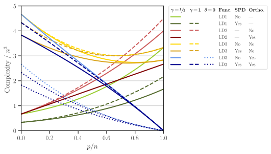

.. _benchmark:

Benchmark Tests
===============

A numerical analysis on the performance of |project| functions is presented in Section 4 of [1]_. Here, we provide supplemental details on how to reproduce the numerical results of that reference.

This notebook plots the results that are produced by |benchmark_py|_ script. The purpose of this script is to compare the presented method versus the conventional method of computing the determinant functions described below.

Test Functions
--------------

Consider the matrices :math:`\mathbf{A} \in \mathbb{R}^{n \times n}` and :math:`\mathbf{X} \in \mathbb{R}^{n \times p}`. We compute  the matrix function

.. math::

    \begin{align}
        \mathrm{loggdet}(\mathbf{A}, \mathbf{X}) :=& \mathrm{logdet}(\mathbf{A}) +  \mathrm{logdet}(\mathbf{X}^{\intercal} \mathbf{A}^{-1} \mathbf{X}), \tag{LD1}\\
        =& \mathrm{logdet}(\mathbf{X}^{\intercal}  \mathbf{X}) + \mathrm{logdet}(\mathbf{N}), \tag{LD2}\\
        =& \mathrm{logdet}(\mathbf{X}^{\intercal}  \mathbf{X}) + \mathrm{logdet}(\mathbf{U}_{\mathcal{X}^{\perp}}^{\intercal} \mathbf{A} \mathbf{U}_{\mathcal{X}^{\perp}}), \tag{LD3}
    \end{align}

where

* :math:`\mathbf{N} = \mathbf{A} + \mathbf{P} - \mathbf{A}\mathbf{P}`
* :math:`\mathbf{P} = \mathbf{I} - \mathbf{X}(\mathbf{X}^{\intercal} \mathbf{X})^{-1} \mathbf{X}`
* :math:`\mathbf{M} = \mathbf{A}^{-1} - \mathbf{A}^{-1} \mathbf{X}(\mathbf{X}^{\intercal} \mathbf{A}^{-1} \mathbf{X})^{-1} \mathbf{X}^{\intercal} \mathbf{A}^{-1}`.
* :math:`\mathbf{U}_{\mathcal{X}^{\perp}}` is the orthonormal basis that is orthogonal to the image of :math:`\mathbf{X}`.

The function :math:`\mathrm{logdet}(\mathbf{A}, \mathbf{X})` is implemented by :func:`detkit.loggdet`. To use either of the relations LD1, LD2, and LD3, the parameters ``method=legacy``, ``method=proj``, and ``method=comp`` can be passed to this function, respectively.

In our experiment, we *assume* both cases:

    * :math:`\mathbf{X}` is orthogonal.
    * :math:`\mathbf{X}` is not orthogonal.

We also *assume* both cases where

    * :math:`\mathbf{A}` is SPD.
    * :math:`\mathbf{A}` is not SPD.

The complexity of computing :math:`\mathrm{logdet}(\mathbf{A}, \mathbf{X})` using either of LD1, LD2, or LD3 relations in the above is shown in the figure below (see also Figure 1 of [1]_). 

In the benchmark test, we compare the process time and the empirical computational FLOPs of the relations LD1, LD2, and LD3.

Dataset
-------

In our experiment, the matrix :math:`\mathbf{X}` is generated by :math:`sin(\omega x)` and :math:`\cos(\omega x)` basis functions in the domain :math:`x \in [0, 1]` and :math:`\omega` is varied. This matrix can be generated by the function :func:`detkit.design_matrix`. We set the size :math:`n \times p`. The ratio :math:`p/n` is varied from :math:`0, \cdots, 1` at :math:`t=30` different ratios, while :math:`n` is fixed. The columns of this matrix are orthogonalized.

Also, the matrix :math:`\mathbf{A}` is obtained by :func:`detkit.covariance_matrix` function. The generated matrix is symmetric and positive-definite (SPD). This function generates the covariance matrix corresponding to the autocorrelation function of an electrocardiogram (ECG) signal [2]_ [3]_. A part of the ECG signal is shown in the figure below.

.. image:: _static/images/plots/electrocardiogram.png
    :align: center
    :class: custom-dark

The autocorrelation function corresponding to 30 seconds of the above signal is shown in Figure (a) below. Also, the corresponding covariance matrix is shown in Figure (c). Here we set the matrix size to :math:`n = 2**9`. Figure (d) shows the eigenvalues of :math:`\mathbf{A}`, indicating the matrix is positive-definite.

.. image:: _static/images/plots/covariance.png
    :align: center
    :class: custom-dark

.. note::

    The following numerical results are insensitive to the matrices used during the benchmark tests. Users can test the following benchmark test with randomly generated matrices.

Configure Settings
------------------

The following numerical experiment consists of testing the code with two different implementations for Gramian matrix multiplications within the source code of this package. To do so, the source code should be configured and |project| needs to be compiled for each configuration as described below.

.. note::

    Note that a normal usage of |project| does not require compiling it from source.

First, obtain the source code of |project| by

   .. prompt:: bash

        git clone http://www.github.com/ameli/detkit

To configure the Gramian matrix multiplication, modify |definitions|_ file as follows:

* Set ``USE_SYMMETRY`` to ``1`` to use symmetry in Gramian matrix multiplication, 
* Set ``USE_SYMMETRY`` to ``0`` to not use symmetry in Gramian matrix multiplication.

.. note::

    In |definitions|_ files, there are also other settings as follows:

    * ``CHUNK_TASKS`` should be set to ``1``. If it is set to ``0``, first, the process times become very oscillatory, and second, the FLOPs per unit matrix-multiplication task (``matmat`` task) becomes a different number. For example, with chunk, the FLOP of ``matmat`` is near 5, and without it, it is 10.
    * ``USE_OPENMP`` should be set to ``0`` to properly compare both methods of LHS and RHS.

For each of the above cases, compile the package as described in :ref:`compile`, then run the experiment as described below.

Perform Benchmark Test
----------------------

.. note::

    To run the following tests, make sure the Linux `perf tool` is installed as described in :ref:`dependencies`. Note that the followings can only be tested on Linux.

The benchmark script is |benchmark_py|_ file located at |benchmark_folder|_ directory of the source code. This script accepts some user arguments in the command line which can be found by inquiring its help by

.. prompt:: bash

    cd detkit/benchmark/scripts
    python ./benchmark.py -h

The above command prints the usage of the script as shown below:

.. code-block::

    Usage: benchmark.py <arguments>

    The following arguments are required:

        -n --size=[int]         Size of the matrix in log2. The size of matrix is 2
                                to the power of this number.
        -f --func=[str]         Type of function, which can be either "loggdet", or
                                "logpdet".

    The following arguments are optional:

        -b --blas               Computes logdet using existing libraries in numpy
                                and scipy, otherwise, it uses the cython code.
        -r --repeat=[int]       Number of times the numerical experiment is
                                repeated. Default is 10.
        -t --num-ratios=[int]   Number of ratios (m/n) from 0 to 1 to be tested.
                                Default is 50.
        -v --verbose            Prints verbose output. Default is False.
        -h --help               Prints the help message.

    Examples:

        1. Compute loggdet, set the matrix size to n=2**8=256, the array of 50
           ratios m/n from 0 to 1, i.e. linspace(0, 1, 50), and repeat each
           experiment 3 times:

           $ benchmark.py -n 8 -f loggdet -r 3 -t 50 -v

        2. Compute logpdet, set the matrix size to n=2**9=512, the array of 100
           ratios m/n from 0 to 1, i.e. linspace(0, 1, 100), and repeat each
           experiment 5 times:

           $ benchmark.py -n 9 -f logpdet -r 5 -t 100 -v

We run the script with :math:`n = 2^9`, repeating the results by :math:`r=10` times and generate :math:`t = 30` data points in the interval for :math:`p/n = 0, \cdots, 1`.

.. prompt:: bash

    cd /detkit/benchmark/scripts
    python ./benchmark.py -n 9 -f loggdet -r 10 -t 30 -v

Run on Cluster
~~~~~~~~~~~~~~

To run the |benchmark_py|_ script on a cluster, use the job files provided in |jobfiles_folder|_ directory.

.. note::

    Run the benchmakr script on only one processor thread to produce accurate results.

* To run the experiment on a cluster with `Torque` workload manager, submit |jobfile_torque|_ job file by

  .. prompt:: bash
  
      cd /imate/benchmark/jobfiles
      qsub jobfile_benchmark.pbs

* To run the experiment on a cluster with `SLURM` workload manager, submit |jobfile_slurm|_ job file by

  .. prompt:: bash
  
      cd /imate/benchmark/jobfiles
      sbatch jobfile_benchmark.sh

Before submitting the job, on either of the job Torque or SLURM files, make sure the followings are set: ``N=9`` (corresponding to :math:`n = 2^9`), ``NUM_RATIOS=30`` (corresponding to :math:`t=30`), ``REPEAT=10`` (corresponding to :math:`r=10`). Also, set ``FUNC="loggdet"``, which computes :math:`\mathrm{logdet}(\mathbf{A}, \mathbf{X})`.

Output Files
------------

The output of the above two experiments will be stored in |pickle_results|_ directory. Corresponding to each experiment, the output file is as follows:

   +----------------------------------------+--------------------------+---------------+-------------------------------+
   | Output filename                        | function                 | matrix size   | Gramian Matrix Multiplication |
   +========================================+==========================+===============+===============================+
   | ``benchmark_loggdet_9_gram.pickle``    | :math:`\mathrm{loggdet}` | :math:`n=2^9` | with symmetry                 |
   +----------------------------------------+--------------------------+---------------+-------------------------------+
   | ``benchmark_loggdet_9_no-gram.pickle`` | :math:`\mathrm{loggdet}` | :math:`n=2^9` | without symmetry              |
   +----------------------------------------+--------------------------+---------------+-------------------------------+

Plot Results
------------

Make sure the above ``*.pickle`` files are stored in |pickle_results|_ directory. To reproduce the plots, run the notebook file |notebook_benchmark|_. The notebook stores the plots as `svg` and `pdf` files in |plots|_ directory. These plots correspond to Figure 2 of [1]_, which is also shown below.

.. image:: _static/images/plots/loggdet-9-exp-flops-proc-time.svg
    :align: center
    :class: custom-dark

.. |benchmark_folder| replace:: ``/detkit/benchmark``
.. _benchmark_folder: https://github.com/ameli/detkit/tree/main/benchmark

.. |jobfiles_folder| replace:: ``/detkit/benchmark/jobfiles``
.. _jobfiles_folder: https://github.com/ameli/detkit/tree/main/benchmark/jobfiles

.. |benchmark_py| replace:: ``/detkit/benchmark/scripts/benchmark.py``
.. _benchmark_py: https://github.com/ameli/detkit/blob/main/benchmark/scripts/benchmark.py

.. |jobfile_torque| replace:: ``/detkit/benchmark/jobfiles/jobfile_benchmark.pbs``
.. _jobfile_torque: https://github.com/ameli/detkit/blob/main/benchmark/jobfiles/jobfile_benchmark.pbs

.. |jobfile_slurm| replace:: ``/detkit/benchmark/jobfiles/jobfile_benchmark.sh``
.. _jobfile_slurm: https://github.com/ameli/detkit/blob/main/benchmark/jobfiles/jobfile_benchmark.sh

.. |pickle_results| replace:: ``/detkit/benchmark/pickle_results``
.. _pickle_results: https://github.com/ameli/detkit/tree/main/benchmark/pickle_results

.. |notebook_benchmark| replace:: ``/detkit/benchmark/notebooks/benchmark_plot_draft_3.ipynb``
.. _notebook_benchmark: https://github.com/ameli/detkit/blob/main/benchmark/notebooks/benchmark_plot_draft_3.ipynb

.. |plots| replace:: ``/imate/benchmark/plots/``
.. _plots: https://github.com/ameli/imate/blob/main/benchmark/plots

.. |definitions| replace:: ``/detkit/detkit/_definitions/definitions.h``
.. _definitions: https://github.com/ameli/detkit/blob/main/detkit/_definitions/definitions.h

References
----------
   
.. [1] Ameli, S., and Shadden. S. C. (2022). *A Singular Woodbury and Pseudo-Determinant Matrix Identities and Application to Gaussian Process Regression* |ameli-woodbury| |btn-bib-1| |btn-view-pdf-1|
   
   .. raw:: html

        

        

        <pre class="language-bib">
        <code class="language-bib">@misc{arxiv.2207.08038,
            doi = {10.48550/arXiv.2207.08038},
            author = {Ameli, S. and Shadden, S. C.}, 
            title = {A Singular Woodbury and Pseudo-Determinant Matrix Identities and Application to Gaussian Process Regression},
            year = {2022}, 
            archivePrefix={arXiv},
            eprint = {2207.08038},
            primaryClass={math.NA},
            howpublished={\emph{arXiv}: 2207.08038 [math.ST]},
        }</code></pre>
        

        

.. [2] Moody GB, Mark RG. The impact of the MIT-BIH Arrhythmia Database.
       IEEE Eng in Med and Biol 20(3):45-50 (May-June 2001).
       (PMID: 11446209); DOI: `10.13026/C2F305
       <https://doi.org/10.13026/C2F305>`__

.. [3] Goldberger AL, Amaral LAN, Glass L, Hausdorff JM, Ivanov PCh, Mark
       RG, Mietus JE, Moody GB, Peng C-K, Stanley HE. PhysioBank,
       PhysioToolkit, and PhysioNet: Components of a New Research Resource
       for Complex Physiologic Signals. Circulation 101(23):e215-e220;
       DOI: `10.1161/01.CIR.101.23.e215
       <https://doi.org/10.1161/01.CIR.101.23.e215>`__

.. |btn-bib-1| raw:: html

    <button class="btn btn-outline-info btn-sm btn-extra-sm" type="button" data-toggle="collapse" data-target="#collapse-bib1">
        BibTeX
    </button>
    
.. |btn-view-pdf-1| raw:: html

    <button class="btn btn-outline-info btn-sm btn-extra-sm" type="button" id="showPDF01">
        PDF
    </button>
    
.. |ameli-woodbury| image:: https://img.shields.io/badge/arXiv-2207.08038-b31b1b.svg
   :target: https://doi.org/10.48550/arXiv.2207.08038
   :alt: arXiv 2207.08038
