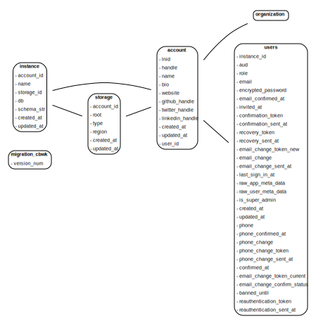

# Migrations

- Generate: `alembic --config lnhub_rest/schema/alembic.ini --name cbwk revision --autogenerate -m "vX.X.X"`
- Apply to production database: `alembic --config lnhub_rest/schema/alembic.ini --name cbwk upgrade head`

| Date       | Migration    | Version | Developer | Notes                                                                                                            | Schema                                        |
| ---------- | ------------ | ------- | --------- | ---------------------------------------------------------------------------------------------------------------- | --------------------------------------------- |
| 2023-01-14 | f7ba9352c706 | 0.0.2   | Alex      | [PR28](https://github.com/laminlabs/lnhub-rest/pull/28)                                                          |  |
| 2023-01-13 | c555c87a640c | 0.0.1   | Alex      | [PR23](https://github.com/laminlabs/lnhub-rest/pull/23), [PR26](https://github.com/laminlabs/lnhub-rest/pull/26) |
| 2023-01-13 | 53709f2a2043 | -       | Alex      | [PR23](https://github.com/laminlabs/lnhub-rest/pull/23), [PR26](https://github.com/laminlabs/lnhub-rest/pull/26) |
